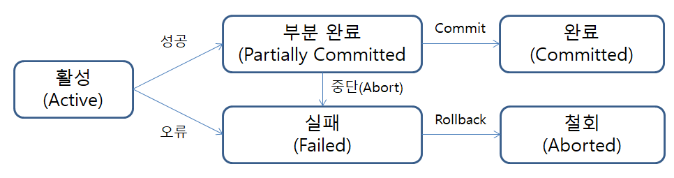
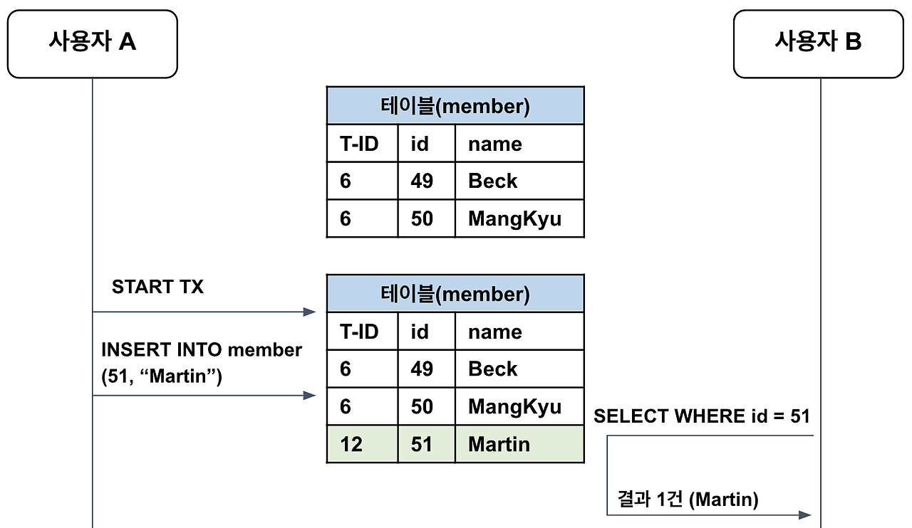
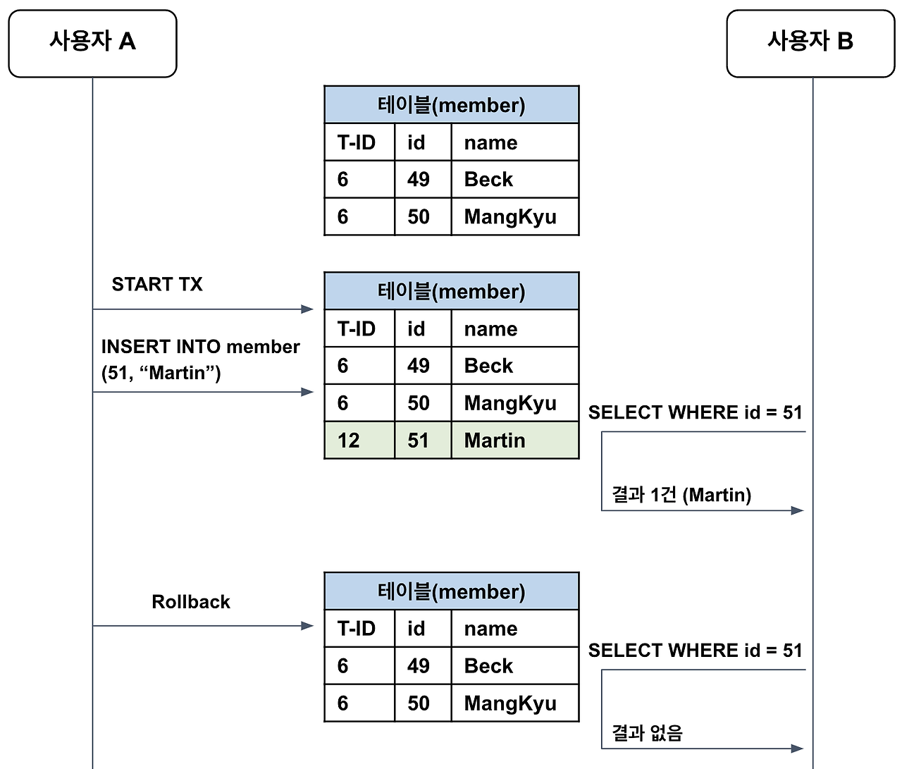
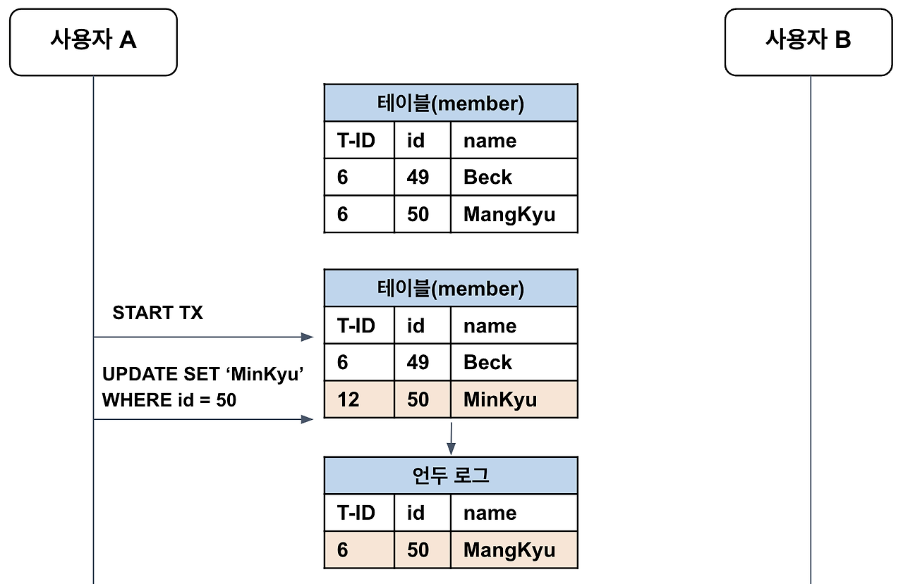
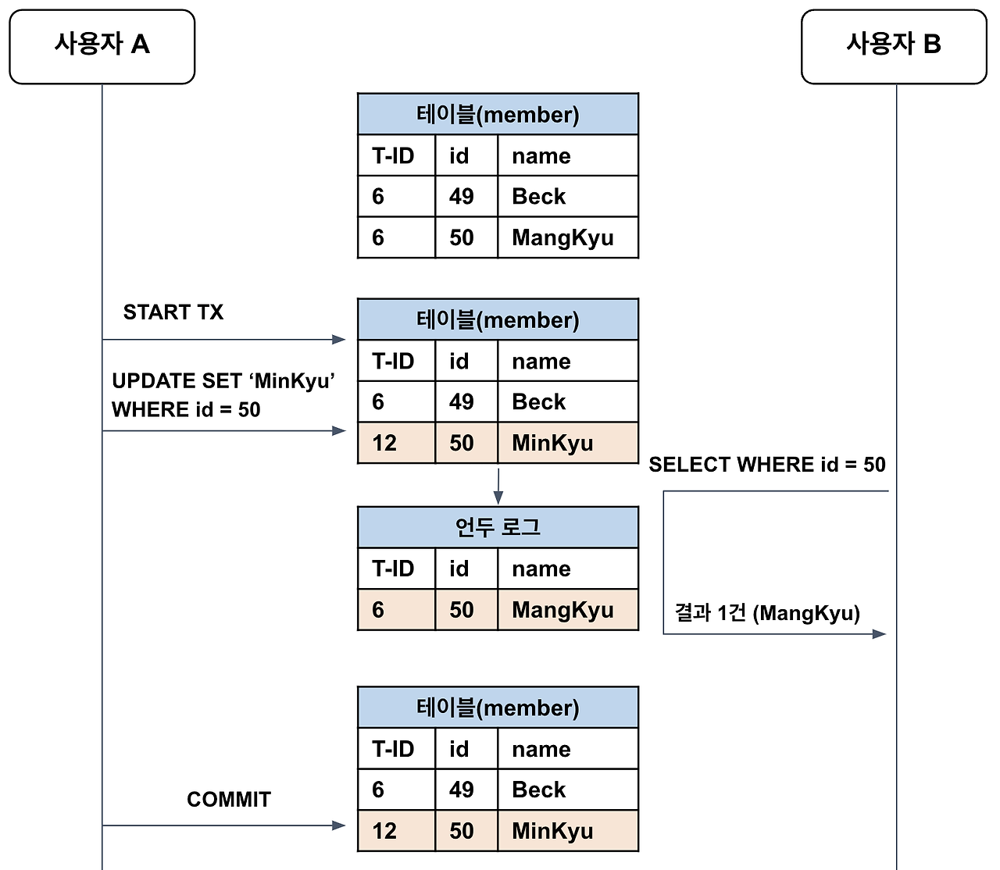
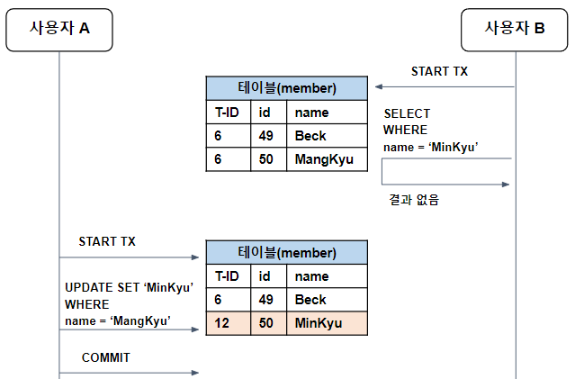
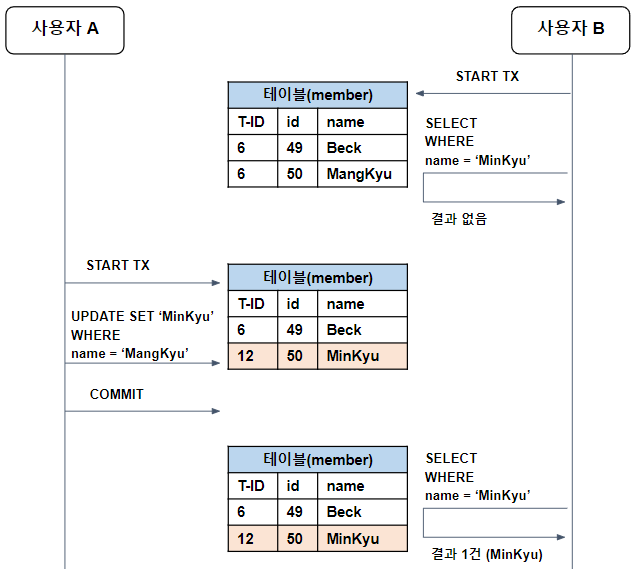
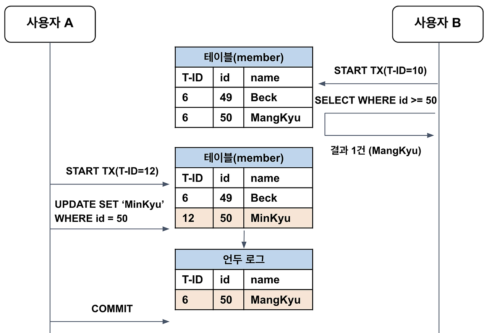
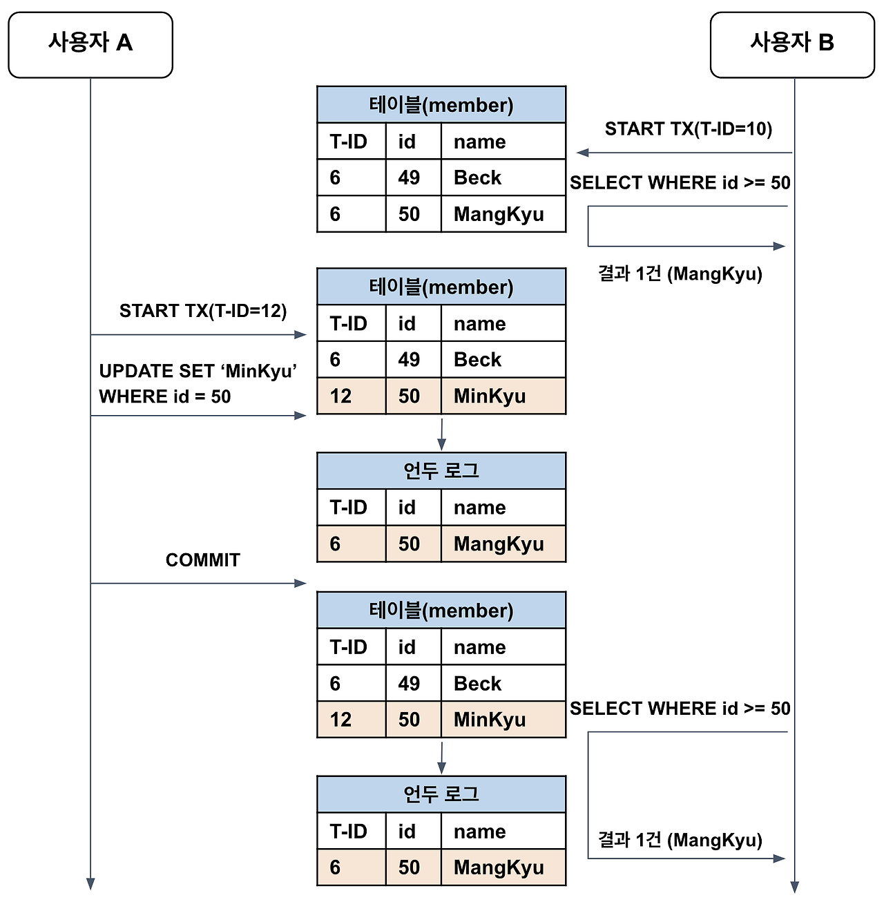

# 트랜잭션

> 2025.02.06. 목 작성 (by 인피케이)

## 1. 트랜잭션 (Transaction)

- 트랜잭션(Transaction)의 사전적 의미는 거래이다.
- 컴퓨터 과학 분야에서 트랜잭션은 더 이상 분할이 불가능한 업무 처리의 단위를 의미한다.
    - 즉, 한꺼번에 수행되어야 하는 일련의 연산 모음을 의미한다.

---

## 2. 간단한 예시를 통한 트랜잭션 설명

- 예를 들어, A가 B에게 송금하는 상황을 가정하자.
    - A가 B에게 송금하는 행위는 크게 출금과 입금 두 개의 과정으로 이루어진다.
    - 우선 A의 계좌에서 송금할 금액만큼 차감한 다음, B의 계좌에 송금한 금액만큼 입금되어야 한다.
- 이때 출금만 되고 입금이 안되는 경우가 발생하면 안되므로, 트랜잭션이 필요하다.
- 즉, 출금과 입금 두 과정은 동시에 성공하거나, 그렇지 않다면 동시에 실패해야 한다.
- 이렇게 두 과정을 (atomic하게) 하나로 묶는 것이 바로 트랜잭션이다.

---

## 3. 트랜잭션의 특징 (ACID)

1. 원자성(Atomicity) : 트랜잭션의 모든 연산이 완전히 수행되거나, 그렇지 않다면 전혀 수행되지 않아야 한다.
2. 일관성(Consistency) : 트랜잭션의 작업 처리 결과는 항상 일관성이 있어야 한다.
    - 트랜잭션이 진행되는 동안 데이터베이스가 변경되더라도, 업데이트된 데이터베이스로 트랜잭션이 진행되는 것이 아니라, 처음에 트랜잭션이 진행하기 위해 참조한 데이터베이스로 진행되어야 한다.
3. 독립성(Isolation) : 둘 이상의 트랜잭션이 동시에 실행될 경우, 어떤 트랜잭션도 다른 트랜잭션의 연산에 끼어들 수 없다.
    - 즉, 하나의 트랜잭션이 완료될 때까지, 다른 트랜잭션이 특정 트랜잭션의 결과를 참조할 수 없다.
4. 지속성(Durability) : 트랜잭션이 성공적으로 완료되었을 경우, 그 결과는 영구적으로 반영되어야 한다.

---

## 4. 트랜잭션의 상태



1. 활성(Active) : 트랜잭션이 정상적으로 실행 중인 상태이다.
    - 트랜잭션이 시작되면 해당 트랜잭션의 상태는 활성(active) 상태가 된다.
2. 부분 완료(Partially Committed) : 트랜잭션의 마지막까지 실행되었지만 아직 commit 연산이 수행되기 전의 상태이다.
3. 완료(Commited) : 트랜잭션이 마지막까지 실행되고 commit 연산까지 수행한 후 트랜잭션이 성공적으로 종료된 상태이다.
4. 실패(Failed) : 트랜잭션 실행 중 오류가 발생하여 중단된 상태이다.
5. 철회(Aborted) : 트랜잭션이 비정상적으로 종료되어 rollback 연산을 수행한 상태이다.

---

## 5. 트랜잭션의 연산

1. 커밋(Commit) 연산 : 트랜잭션이 성공적으로 실행되어 그 결과를 DB에 영구적으로 반영하기 위한 명령어이다.
2. 롤백(Rollback) 연산 : 트랜잭션 실행 중 문제가 발생하여 트랜잭션의 처리 과정에서 발생한 변경사항을 취소하는 명령어이다.
    - 롤백 연산을 수행하면 트랜잭션이 시작되기 전의 상태, 즉 마지막 commit을 완료한 시점으로 되돌아간다.

---

## 6. MySQL에서의 트랜잭션

- MySQL에서 트랜잭션은 데이터베이스의 상태를 바꾸는 일종의 작업 단위이다.
- 기본적으로 MySQL에서는 자동 commit이 설정되어 있다.
    - 즉, INSERT, DELETE, UPDATE 등의 SQL 명령어를 한 번 실행할 때마다 DB에서 자동으로 commit이 수행된다.
- 아래 명령어를 통해 MySQL의 기본 commit 방식을 설정할 수 있다.
    
    ```sql
    SELECT @@autocommit; -- 오토커밋 설정 확인
    
    SET AUTOCOMMIT = 0; -- 오토커밋 off
    
    SET AUTOCOMMIT = 1; -- 오토커밋 on
    ```
    
- 아래 명령어를 통해 트랜잭션을 실행할 수 있다.
    1. 트랜잭션 시작
        
        ```sql
        START TRANSACTION;
        ```
        
        - 이때 commit 방식은 수동 commit으로 바뀐다.
    2. 커밋 (변경사항 저장)
        
        ```sql
        COMMIT;
        ```
        
    3. 롤백 (변경사항 취소)
        
        ```sql
        ROLLBACK;
        ```
        

### (1) 트랜잭션 커밋 예제

- 1번 계좌에서 10만원 출금 후 2번 계좌에 입금하는 트랜잭션을 실행하는 예제이다.

```sql
START TRANSACTION; -- 트랜잭션을 시작한다.

SELECT * FROM accounts; -- 초기 상태를 확인한다.

-- 1번 계좌에서 10만원을 출금한다.
UPDATE accounts SET balance = balance - 100000 WHERE account_id = 1;

-- 2번 계좌에 10만원을 입금한다.
UPDATE accounts SET balance = balance + 100000 WHERE account_id = 2;

SELECT * FROM accounts; -- 수정된 상태를 확인한다.

COMMIT; -- 트랜잭션의 결과를 DB에 적용한다.

SELECT * FROM accounts; -- DB에 적용된 결과를 조회한다.
```

### (2) 트랜잭션 롤백 예제

```sql
START TRANSACTION; -- 트랜잭션을 시작한다.

SELECT * FROM accounts; -- 초기 상태를 확인한다.

-- 1번 계좌에서 10만원을 출금한다.
UPDATE accounts SET balance = balance - 100000 WHERE account_id = 1;

-- 999번 계좌에 10만원을 입금한다.
-- 만약 999번 계좌가 존재하지 않아서 오류가 발생했다고 가정하면 롤백 연산을 수행해야 할 것이다.
UPDATE accounts SET balance = balance + 100000 WHERE account_id = 999;

SELECT * FROM accounts; -- 수정된 상태를 확인한다.

ROLLBACK; -- 트랜잭션을 취소하고 트랜잭션 시작 이전의 상태로 되돌아간다.

SELECT * FROM accounts; -- 트랜잭션 시작 이전의 상태로 되돌아갔는지 확인한다.
```

---

## 7. 트랜잭션 예외

- 모든 명령어에 대하여 트랜잭션의 롤백 명령이 적용되는 것은 아니다.
- DDL문( `CREATE` , `DROP` , `ALTER` , `RENAME` , `TRUNCATE` )은 트랜잭션의 롤백 대상이 아니다. 즉, DDL문은 롤백이 되지 않으므로 주의해야 한다.

---

## 8. 트랜잭션의 격리 수준 (Transaction Isolation Level)

### (1) READ UNCOMMITTED (읽기 미확정)

- 커밋되지 않은 데이터에도 접근할 수 있다.
- 다른 트랜잭션의 작업이 commit 또는 rollback 되지 않아도 즉시 보이게 된다.



- 위와 같이 어떤 트랜잭션의 작업이 완료되지 않았는데도 다른 트랜잭션에서 볼 수 있는 부정합 문제를 dirty read라고 한다.
- 만약 위의 경우에 사용자 A가 commit이 아닌 rollback을 수행한다면?



- 사용자 B의 트랜잭션은 id = 51인 데이터를 계속 처리하고 있었는데, 데이터를 다시 조회하니 결과가 존재하지 않는 상황이 발생한다.
- 즉, 이러한 dirty read 상황은 시스템에 상당한 버그를 초래하게 된다. 따라서 MySQL을 사용한다면 최소한 READ COMMITTED 이상의 격리 수준을 사용해야 한다.

---

### (2) READ COMMITTED (읽기 확정)

- 커밋된 데이터만 조회할 수 있다.
- READ COMMITTED에서는 Phantom Read(유령 읽기) 문제와 Non-Repeatable Read(반복 읽기 불가능) 문제가 발생할 수 있다.
- Non-Repeatable Read(반복 읽기 불가능) 문제 발생 예시
    - 예를 들어 사용자 A가 트랜잭션을 시작하여 어떤 데이터를 변경하고 아직 commit은 하지 않은 상태를 가정하자.
    - 그러면 테이블은 먼저 갱신되고, UNDO 로그로 변경 이전의 데이터가 백업된다.
    
    
    
    - 이때 사용자 B가 데이터를 조회하려고 하면, READ COMMITTED에서는 커밋된 데이터만 조회할 수 있으므로, UNDO 로그에서 변경 이전의 데이터를 찾아서 반환한다.
    - 최종적으로 사용자 A가 트랜잭션을 커밋하면 그때부터 다른 트랜잭션에서도 새롭게 변경된 값을 참조할 수 있다.
    
    
    
    - 하지만 READ COMMITTED에서는 Non-Repeatable Read(반복 읽기 불가능) 문제가 발생할 수 있다.
    - 아래 상황에서 사용자 B가 트랜잭션을 시작하고 name = "Minkyu"인 레코드를 조회한다면?
    - 해당 조건을 만족하는 레코드는 아직 존재하지 않으므로(커밋 전이라 존재하지 않음) 아무 것도 반환되지 않는다.
    
    
    
    - 그러다가 사용자 A가 UPDATE 문을 수행하고 커밋까지 수행해서 해당 조건을 만족하는 레코드가 생겼다고 하자.
    - 이때 사용자 B가 아까와 동일한 조건으로 레코드를 조회한다면?
    - 아까와 다르게 이번에는 1개의 레코드가 반환된다.
    
    
    
    - 즉, READ COMMITTED에서 반복 읽기를 수행하면 다른 트랜잭션의 커밋 여부에 따라 조회 결과가 달라질 수 있다.
    - 이러한 문제를 Non-Repeatable Read(반복 읽기 불가능) 문제라고 한다.
- Non-Repeatable Read(반복 읽기 불가능) 문제는 일반적인 경우에는 크게 문제가 되지 않지만, 하나의 트랜잭션에서 동일한 데이터를 여러 번 읽고 변경하는 작업이 금전적인 처리와 연결되면 문제가 발생할 수 있다.
    - 어떤 트랜잭션에서는 오늘 입금된 총합을 계산하고 있는데, 다른 트랜잭션에서 계속해서 입금 내역을 커밋하는 상황을 예시로 들 수 있다. 이 경우 READ COMMITTED에서는 같은 트랜잭션일지라도 조회할 때마다 입금 내역이 달라지므로 문제가 생길 수 있다.
    - 따라서 격리 수준이 어떻게 동작하는지, 그리고 격리 수준에 따라 어떠한 결과가 나오게 되는지 예측할 수 있어야 한다.

---

### (3) REPEATABLE READ (반복 가능 읽기)

> ### MVCC(Multi-Version Concurrency Control, 다중 버전 동시성 제어)
> 
> - 일반적인 RDBMS는 변경 이전의 레코드를 UNDO 공간에 백업한다. 그러면 변경 전과 변경 후의 데이터가 모두 존재하므로, 동일한 레코드에 대해 여러 버전의 데이터가 존재하게 된다. 이를 MVCC(Multi-Version Concurrency Control, 다중 버전 동시성 제어)라고 한다.
> - MVCC를 통해 트랜잭션이 롤백된 경우에 데이터를 복원할 수 있고, 서로 다른 트랜잭션 간에 접근할 수 있는 데이터를 세밀하게 제어할 수 있다.
> - 각각의 트랜잭션은 순차 증가하는 고유한 트랜잭션 번호가 존재하며, 백업 레코드에는 어느 트랜잭션에 의해 백업되었는지를 확인할 수 있도록 트랜잭션 번호를 함께 저장한다.
> - 그리고 해당 데이터가 불필요하다고 판단되는 시점에 주기적으로 백그라운드 쓰레드를 통해 삭제한다.

- REPEATABLE READ에서는 MVCC를 이용하여 한 트랜잭션 내에서 동일한 결과를 보장하므로 Non-Repeatable Read(반복 읽기 불가능) 문제가 발생하지 않는다. 하지만 새로운 레코드가 추가되는 경우에 부정합이 생기는 Phantom Read 문제가 발생할 수 있다.
- Non-Repeatable Read(반복 읽기 불가능) 문제는 발생하지 않는다.
    - 예를 들어 사용자 B가 트랜잭션을 시작하고 id = 50인 레코드를 조회하면 1건 조회되는 상황을 가정하자. 그리고 아직 트랜잭션은 종료되지 않았다고 가정하자.
    - 그리고 이때 사용자 A의 트랜잭션에서 id = 50인 레코드를 갱신한다고 가정하자.
    - 그러면 MVCC를 통해 기존 데이터는 변경되지 않지만, 백업된 데이터가 UNDO 로그에 남게 된다.
    
    
    
    - 사용자 B의 트랜잭션이 아직 종료되지 않은 상황에서, 사용자 B가 다시 한번 동일한 SELECT 문을 실행한다면?
    - REPEATABLE READ에서는 트랜잭션 번호를 참고하여 자신보다 먼저 실행된 트랜잭션의 데이터만 조회한다. 또한 자신보다 늦게 실행된 트랜잭션의 데이터가 존재한다면 UNDO 로그를 참고해서 데이터를 조회한다.
    - 사용자 B의 트랜잭션(10번)은 사용자 A의 트랜잭션(12번)이 시작하기 전에 이미 시작된 상태였다. 따라서 조회 결과로 기존과 동일한 데이터를 얻게 된다.
    
    
    
    - 즉, REPEATABLE READ에서는 어떤 트랜잭션이 읽은 데이터를 다른 트랜잭션이 수정하더라도 동일한 결과를 반환하는 것이 보장된다.
- Phantom Read(유령 읽기) 문제가 발생할 수 있다.
    - REPEATABLE READ에서는 새로운 레코드의 추가를 막지 않기 때문에 Phantom Read가 발생할 수 있다.
    - MVCC에서 자신보다 나중에 실행된 트랜잭션이 추가한 레코드는 무시되기 때문에 일반적으로 Phantom Read는 발생하지 않는다.
    - 하지만 Lock이 사용되는 경우 Phantom Read가 발생할 수 있다.

---

### (4) SERIALIZABLE (직렬화)

- 가장 엄격한 격리 수준이다. 가장 안전하지만 가장 성능이 떨어진다.
- SERIALIZABLE에서는 여러 트랜잭션이 동일한 레코드에 동시에 접근할 수 없다. 따라서 트랜잭션은 순차적으로 처리되고 동시 처리 성능이 매우 떨어진다.

---

### (5) 요약

- READ UNCOMMITTED에서는 부정합 문제가 지나치게 많이 발생하고, SERIALIZABLE은 동시성이 상당히 떨어지므로, 일반적으로 READ COMMITTED 또는 REPEATABLE READ를 사용하면 된다.
- 오라클에서는 READ COMMITTED를 기본으로 사용하며, MySQL에서는 REPEATABLE READ를 기본으로 사용한다.

|  | Dirty Read | Non-Repeatable Read | Phantom Read |
| --- | --- | --- | --- |
| READ UNCOMMITTED | O | O | O |
| READ COMMITTED | X | O | O |
| REPEATABLE READ | X | X | O (단, MySQL에서는 거의 발생하지 않음) |
| SERIALIZABLE | X | X | X |

---

## 9. 참고 자료

1. [https://inpa.tistory.com/entry/MYSQL-📚-트랜잭션Transaction-이란-💯-정리](https://inpa.tistory.com/entry/MYSQL-%F0%9F%93%9A-%ED%8A%B8%EB%9E%9C%EC%9E%AD%EC%85%98Transaction-%EC%9D%B4%EB%9E%80-%F0%9F%92%AF-%EC%A0%95%EB%A6%AC) 
2. https://mangkyu.tistory.com/299

---

## 10. MySQL 실습 코드

```sql
-- # 1. 실습 전 스키마 및 테이블 준비

CREATE SCHEMA study_transaction DEFAULT CHARACTER SET utf8;

USE study_transaction;

CREATE TABLE accounts (account_id INT, balance INT);

INSERT INTO accounts VALUES
(1, 500000),
(2, 200000);

SELECT * FROM accounts;

-- # 2. 오토커밋 설정

SELECT @@autocommit; -- 오토커밋 설정 확인

SET AUTOCOMMIT = 0; -- 오토커밋 off

SET AUTOCOMMIT = 1; -- 오토커밋 on

SELECT @@autocommit; -- 오토커밋 설정 확인

-- # 3. 트랜잭션 커밋 예제

START TRANSACTION; -- 트랜잭션을 시작한다.

SELECT * FROM accounts; -- 초기 상태를 확인한다.

-- 1번 계좌에서 10만원을 출금한다.
UPDATE accounts SET balance = balance - 100000 WHERE account_id = 1;

-- 2번 계좌에 10만원을 입금한다.
UPDATE accounts SET balance = balance + 100000 WHERE account_id = 2;

SELECT * FROM accounts; -- 수정된 상태를 확인한다.

COMMIT; -- 트랜잭션의 결과를 DB에 적용한다.

SELECT * FROM accounts; -- DB에 적용된 결과를 조회한다.

-- # 4. 트랜잭션 롤백 예제

START TRANSACTION; -- 트랜잭션을 시작한다.

SELECT * FROM accounts; -- 초기 상태를 확인한다.

-- 1번 계좌에서 10만원을 출금한다.
UPDATE accounts SET balance = balance - 100000 WHERE account_id = 1;

-- 999번 계좌에 10만원을 입금한다.
-- 만약 9999번 계좌가 존재하지 않아서 오류가 발생했다고 가정하면 롤백 연산을 수행해야 할 것이다.
UPDATE accounts SET balance = balance + 100000 WHERE account_id = 999;

SELECT * FROM accounts; -- 수정된 상태를 확인한다.

ROLLBACK; -- 트랜잭션을 취소하고 트랜잭션 시작 이전의 상태로 되돌아간다.

SELECT * FROM accounts; -- 트랜잭션 시작 이전의 상태로 되돌아갔는지 확인한다.

-- # 5. 실습 후 테이블 및 스키마 지우기

drop table accounts;

drop schema study_transaction;

show databases;

```
